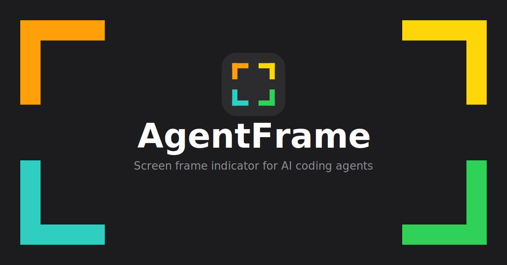
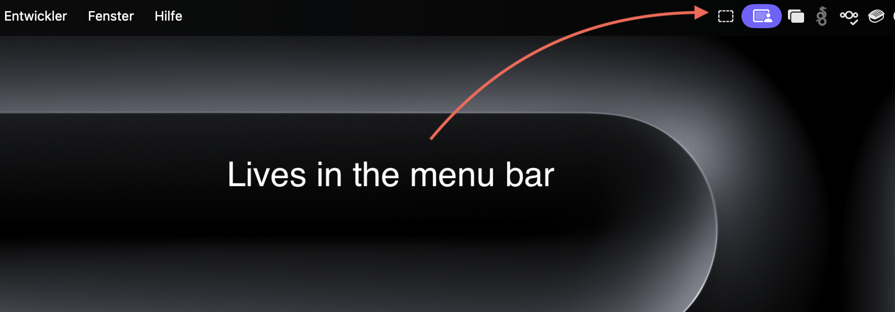
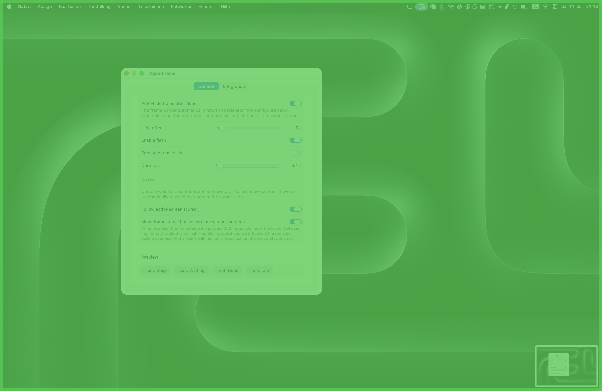
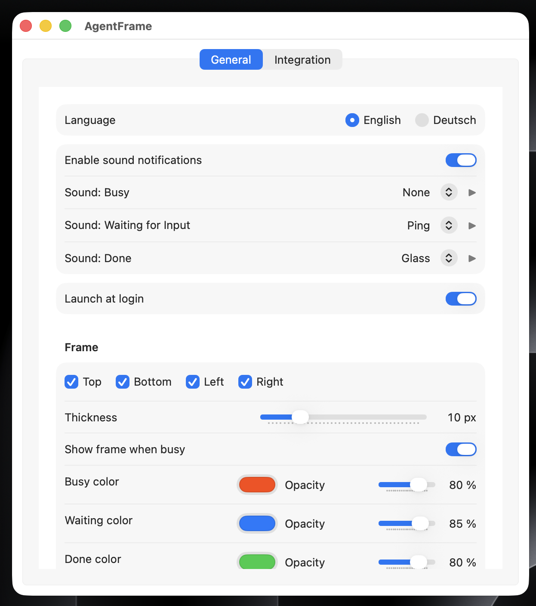
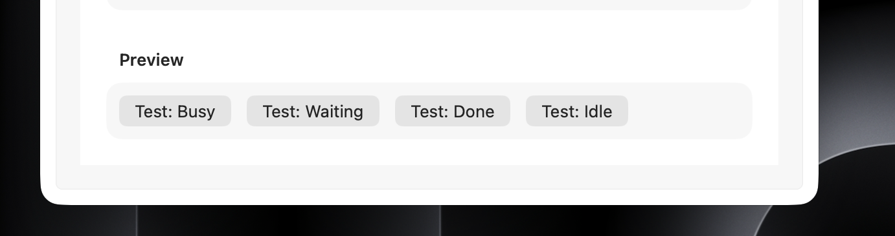
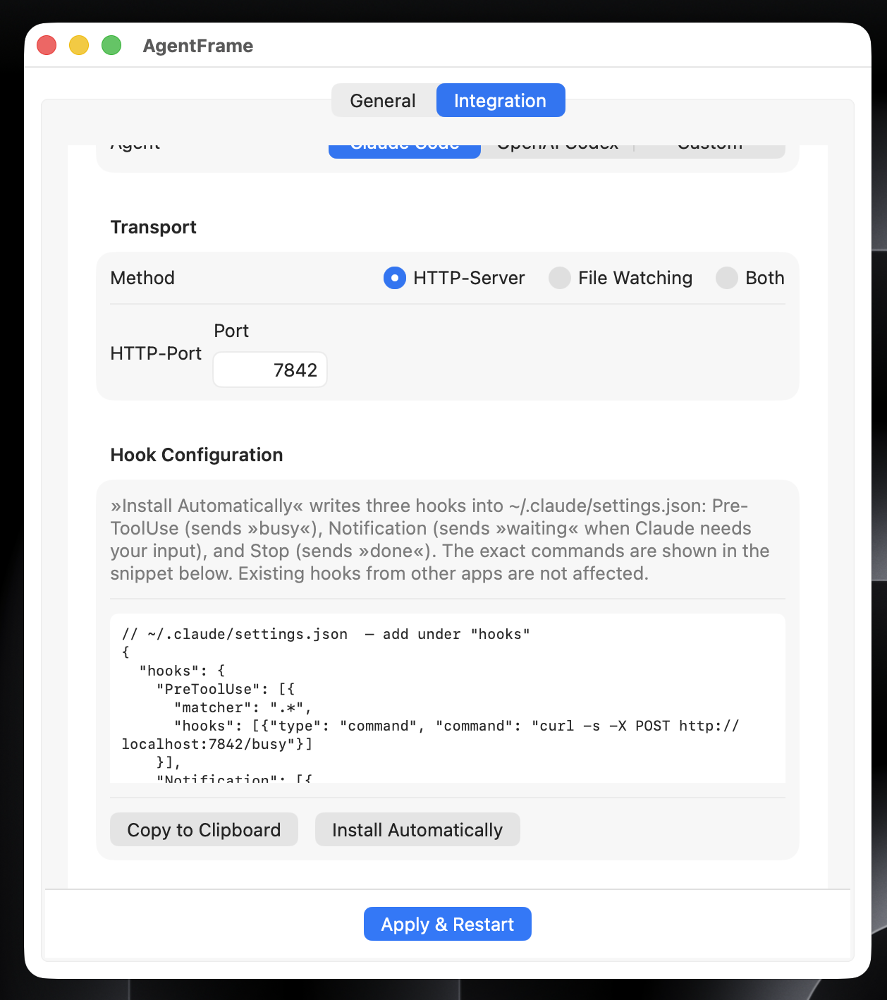
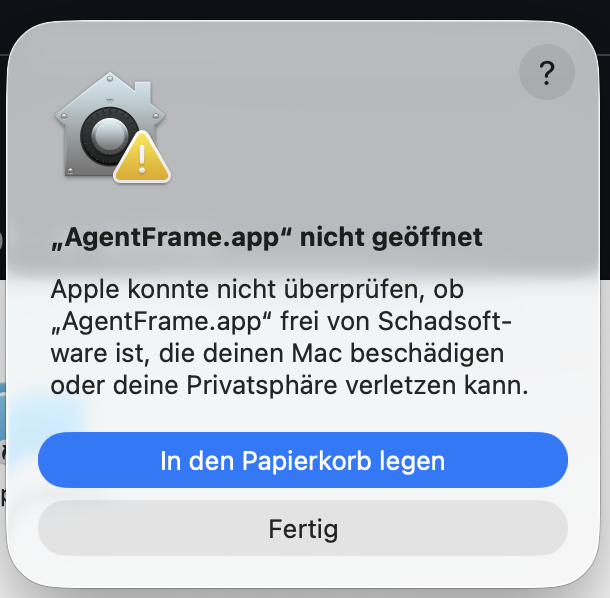
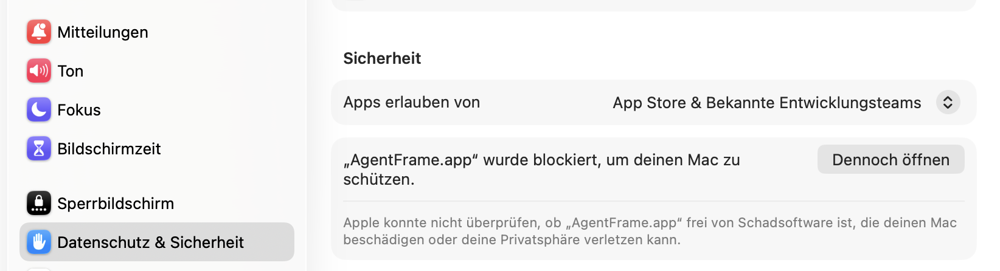
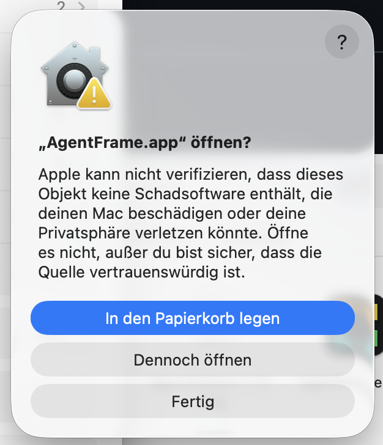

# AgentFrame



   [](https://ko-fi.com/oender)

A lightweight macOS menu bar app that draws a colored border around your screen based on the status of AI coding agents (Claude Code, OpenAI Codex, or any custom agent).

- **Busy** → colored frame appears at the screen edge(s) you configured 
- **Waiting** → when your agent is waiting for input from you a colored frame appears at the screen edge(s) you configured

- **Done** → color switches + optional full-screen flash
- **Idle** → frame disappears

## Features

- Colored frame on any combination of screen edges (top / right / bottom / left)
- Individual color and opacity per status (busy / waiting / done)
- Adjustable frame thickness
- Option to disable the frame for the busy state (done state is always shown)
- Full-screen flash on task completion — auto-dismiss or persistent until click
- Configurable auto-hide delay after done (returns frame to idle automatically)
- Multi-monitor support: main screen, fixed screen, or follow the cursor
- Sound notifications per status (busy / waiting / done)
- Launch at login
- Status input via **HTTP** (default port 7842) or **file watching** — your choice
- Installed hooks visible in Settings with one-click removal
- UI available in **English** and **German**

### How the app looks like

#### Lives in the menu bar



#### Busy state example


#### Waiting state example


#### Finished state example (without flash)


#### Finished state with flash example


#### Settings Screen


#### Test buttons in the preview section

You can click the test buttons to see, how the customized settings would look like 



#### Integration tab

In the integration tab you can find information how to setup the hooks. You can either do it manually or click the install automatically button to install the hooks instantly. The hooks are needed to make the app react to the agent.



---

## Installation

### ⚠️ How to fix the problem, that occurs when starting the app the first time 

Unfortunately i have currently no apple developer account. Thats why i could not license the app. Thats why MacOs is showing an error, when you try to open the app the first time after the download. 

#### The error 



#### The solution

Go to the System Settings and open the Privacy & Security tab and click the "Open Anyway" button. A second confirmation dialog will appear — click "Open Anyway" again. This is required for all applications that are not notarized by Apple.





### Download

1. Go to [Releases](https://github.com/oenderkerem/AgentFrame/releases/latest)
2. Download `AgentFrame-x.x.x.dmg`
3. Open the DMG and drag `AgentFrame.app` to `/Applications`
4. Right-click → **Open** on first launch (macOS Gatekeeper requires this once for unsigned apps)

### Build from source

Requires macOS 13+ and Xcode Command Line Tools (`xcode-select --install`).

```bash
git clone https://github.com/oenderkerem/AgentFrame.git
cd agents-frame
make install   # builds release binary and copies AgentFrame.app to /Applications
```

---

## Connecting Claude Code

Claude Code fires **hooks** — shell commands — at specific lifecycle events. AgentFrame listens for those signals and updates the frame accordingly.

### 1. Start AgentFrame

Launch the app. It starts an HTTP server on `localhost:<PORT>` in the background. The default port is 7842 and can be changed in **Settings → Integration**.

### 2. Install hooks automatically

Open **Settings → Integration**, select **Claude Code** as your agent, then click **Install Automatically**. AgentFrame writes four hooks into `~/.claude/settings.json` — existing hooks from other tools are not touched.

Hooks are installed **once globally** and apply to all projects and sessions automatically. If you want to limit the integration to a single project, copy the snippet from Settings and paste it into `.claude/settings.json` inside that project directory instead.

### 3. Or add hooks manually to `~/.claude/settings.json`

```json
{
  "hooks": {
    "PreToolUse":   [{ "matcher": ".*", "hooks": [{ "type": "command", "command": "curl -s --max-time 1 -X POST http://localhost:<PORT>/agent_frame/busy || true" }] }],
    "PostToolUse":  [{ "matcher": ".*", "hooks": [{ "type": "command", "command": "curl -s --max-time 1 -X POST http://localhost:<PORT>/agent_frame/busy || true" }] }],
    "Notification": [{ "matcher": ".*", "hooks": [{ "type": "command", "command": "curl -s --max-time 1 -X POST http://localhost:<PORT>/agent_frame/waiting || true" }] }],
    "Stop":         [{ "matcher": ".*", "hooks": [{ "type": "command", "command": "curl -s --max-time 1 -X POST http://localhost:<PORT>/agent_frame/done || true" }] }]
  }
}
```

| Hook | When it fires | Signal |
|---|---|---|
| `PreToolUse` | Before each tool call | `busy` → frame appears |
| `PostToolUse` | After each tool call | `busy` → keeps frame active between tools |
| `Notification` | When Claude Code sends an internal notification | `waiting` → frame switches to waiting color |
| `Stop` | When the session completes | `done` → color switches + flash |

> **Note on the Notification hook:** It fires when Claude Code triggers a desktop notification, not every time Claude outputs a question in text. In some cases the frame may stay on busy instead of switching to waiting — this is a limitation of Claude Code's hook system.

AgentFrame also shows a ready-to-copy snippet in **Settings → Integration**.

### Alternative: file-based

If you prefer not to use HTTP, switch to **File Watching** in Settings. Then use:

```bash
# in your hook command:
echo busy    > ~/.claude/agent_frame_status   # busy
echo waiting > ~/.claude/agent_frame_status   # waiting for input
echo done    > ~/.claude/agent_frame_status   # done
echo idle    > ~/.claude/agent_frame_status   # idle
```

---

## Connecting OpenAI Codex

Open **Settings → Integration**, select **OpenAI Codex**, then click **Install Automatically**. AgentFrame sets the `onStart` (sends `/busy`) and `onFinish` (sends `/done`) keys in `~/.codex/config.json` — other settings in that file are not affected.

Or add manually to `~/.codex/config.json`:

```json
{
  "onStart":  "curl -s --max-time 1 -X POST http://localhost:<PORT>/agent_frame/busy",
  "onFinish": "curl -s --max-time 1 -X POST http://localhost:<PORT>/agent_frame/done"
}
```

> **Note:** Codex has no notification hook, so the waiting state (`/waiting`) is not available via auto-install for Codex.

---

## HTTP API

Any agent can send signals via HTTP — no dependency on Claude Code.

```
POST http://localhost:<port>/agent_frame/busy     →  frame appears (busy color)
POST http://localhost:<port>/agent_frame/waiting  →  frame switches to waiting color
POST http://localhost:<port>/agent_frame/done     →  frame appears (done color) + flash
POST http://localhost:<port>/agent_frame/idle     →  frame disappears
POST http://localhost:<port>/agent_frame/status   →  body: {"status":"busy|waiting|done|idle"}
```

The port defaults to `7842` and can be changed in **Settings → Integration**.

---

## Using with any agent

AgentFrame is fully agent-agnostic. The HTTP server and file watcher don't know or care which agent is calling them — any tool that can run a shell command or write a file works out of the box.

To use it with an agent not listed in Settings, just call the endpoints directly from that agent's hook/callback system:

```bash
curl -s --max-time 1 -X POST http://localhost:<port>/agent_frame/busy   # agent started working
curl -s --max-time 1 -X POST http://localhost:<port>/agent_frame/done   # agent finished
```

---

## Settings overview

| Tab | What you configure |
|---|---|
| General | Language, sound notifications, launch at login |
| General → Frame | Edges, thickness, color & opacity per status, busy on/off, auto-hide delay, stuck-busy auto-reset |
| General → Frame → Screen | Which monitor to draw on, follow-cursor mode, live tracking toggle |
| General → Frame → Flash | Enable flash, persistent until click, flash duration |
| General → Preview | Test buttons to trigger busy / waiting / done / idle manually |
| Integration | Agent provider, transport (HTTP / file), port, hook snippet, auto-install / remove hooks, installed hooks inspector |

---

## Contributing

Pull requests are welcome. For larger changes, open an issue first to discuss what you'd like to change.

### Releasing a new version

Releases are automated via GitHub Actions. To publish a new version:

```bash
git tag v<major>.<minor>.<patch>
git push origin v<major>.<minor>.<patch>
```

The workflow will build the app, package it as a DMG, and publish a GitHub Release with the DMG attached. The version number is read from the tag — no manual edits to `Info.plist` or the Makefile required.

The tag must follow the `v<major>.<minor>.<patch>` format and should be pushed from the **main** branch.

---

## License

MIT
